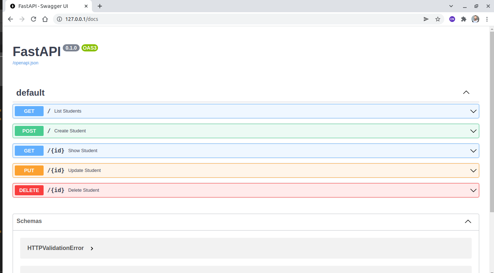
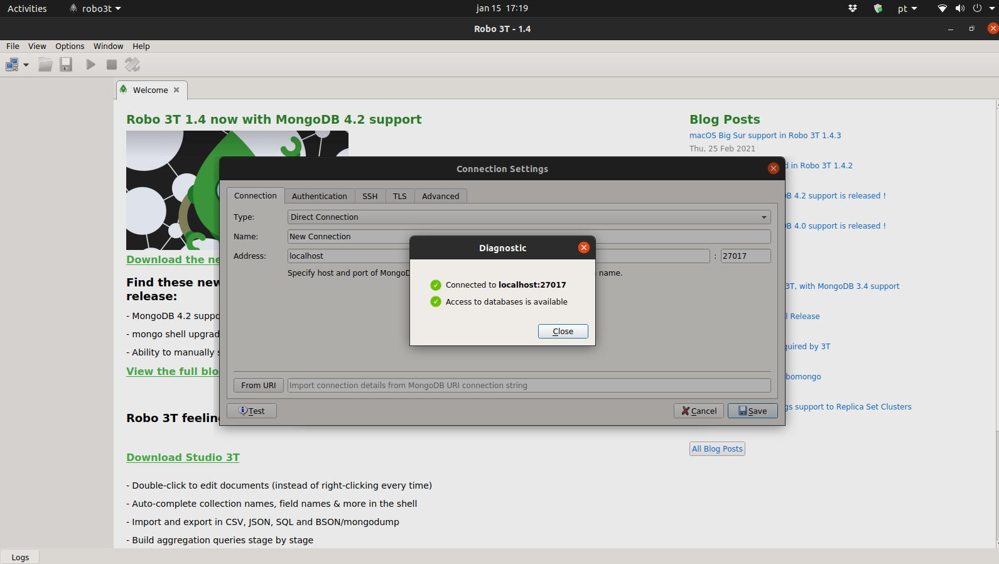
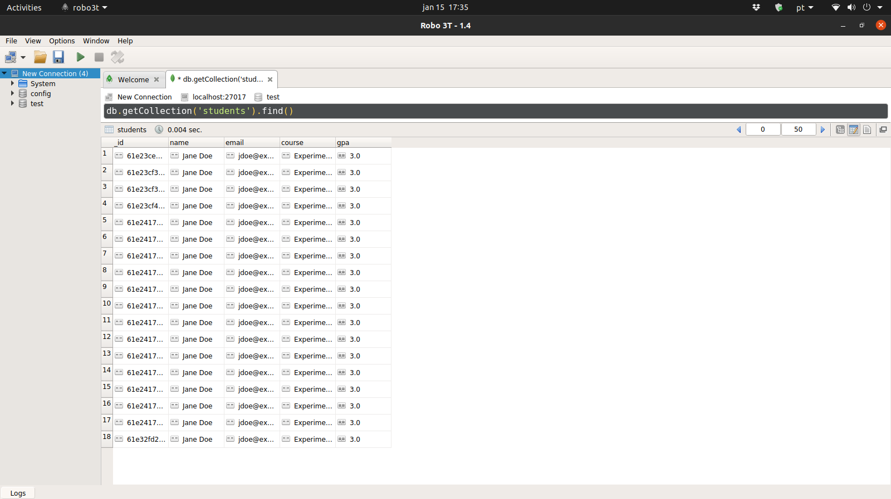

<!-- Title -->

<h1 align="center">
   FastAPI, MongoDB, Docker
</h1>

<!-- Description -->

<h3 align="center">
   Seu lugar para praticar observabilidade e monitoramento em MongoDB.
</h3>

<!-- Badges -->

<p align="center">
   
   </a>
</p>

<!-- Status -->

<h4 align="center">
	🚧 Em desenvolvimento 🚧
</h4>

<!-- Table of content -->

Tabela de conteúdos
=================
* [Sobre o projeto](#-sobre-o-projeto)
* [Funcionalidades](#-funcionalidades)
* [Como executar o projeto](#-como-executar-o-projeto)
   * [Pré-requisitos](#pré-requisitos)
* [Tecnologias](#-tecnologias)
* [Como contribuir no projeto](#-como-contribuir-no-projeto)
* [Autor](#-autor)
* [Licença](#licença)

---

## 💻 Sobre o projeto

Dedici construir esse projeto para treinar com ferramentas que podem estar presentes no dia-a-dia de um engenheiro de dados.

---

## ⚙️ Funcionalidades

- [x] CRUD com api do FastAPI
- [x] Persistencia dos dados com MongoDB
- [ ] Monitoramento com Prometheus e Grafana (em construção)

---

## 🚀 Como executar o projeto

Este projeto é divido em duas partes:
1. API e MongoDB (imagens docker)
2. Robo3T (client para o MongoDB)

💡As imagens do Docker que contém a api e o mongodb estão no arquivo  ```docker-compose.yaml``` . O Robo3T deverá ser instalado direto na máquina.

### Pré-requisitos

Antes de começar, você vai precisar ter instalado em sua máquina as seguintes ferramentas:
[Git](https://git-scm.com), [Robo3T](https://robomongo.org/) e [Docker](https://www.docker.com/). 
Além disto é bom ter um editor para trabalhar com o código como o [VSCode](https://code.visualstudio.com/)

#### 📦 Rodando o Container

```bash

# Clone este repositório
$ git clone https://github.com/IgorFreitasCruz/api-fastapi.git

# Acesse a pasta do projeto no terminal/cmd
$ cd api-fastapi

# Execute a o container com o comando
$ docker-compose up -d

# O servidor inciará na porta:8000 - acesse http://127.0.0.1/docs 

```

É muito importante acessar a url http://127.0.0.1/docs pois o browser tentará renderizar http://127.0.0.1/ e não encontrará um aquivo do tipo ```html```.
<p align="center">
   
</p>

Após ter acesso à api basta conectar ao mongo através do nosso client Robo3T. Por padrão, o Robo3T cria uma coneção em **localhost** na porta **27017**. Clique na aba **File** e selecione **connect**. Em seguina selecione **Create** na janela que irá aparecer. Clique em **Teste** para seguir com a configuração padrão de host e porta e em seguida clique em **Save**.

<p align="center">
   
</p>

A api irá cria um _database_ com o nome **test** e uma coleção com o nome **students**. Para visualizar o conteúdo da coleção clique com o botão direito do mouse em **New Connection** e selecione **Open Shell**. Realize um POST _request_ na api para gerar alguns dados. Após, digite na linha de comando ```db.getCollection('students').find()```. 


<p align="center">
   
</p>

---

## 🛠 Tecnologias

As seguintes ferramentas foram usadas na construção do projeto:

-   **[FastAPI](https://fastapi.tiangolo.com/)**
-   **[MongoDB](https://www.mongodb.com/)**
-   **[Docker](https://www.docker.com/)**

---

## 💪🏻 Como contribuir no projeto

1. Faça um **fork** do projeto.
2. Crie uma nova branch com as suas alterações: `git checkout -b my-feature`
3. Salve as alterações e crie uma mensagem de commit contando o que você fez: `git commit -m "feature: My new feature"`
4. Envie as suas alterações: `git push origin my-feature`
> Caso tenha alguma dúvida confira este [guia de como contribuir no GitHub](./CONTRIBUTING.md)

---

## 🦸 Autor

<a>
 
 <br />
 <sub><b>Igor de Freitas Cruz</b></sub></a> 🚀
 <br />

[](https://www.linkedin.com/in/igorfreitascruz/)
[](mailto:igor.freitas.cruz@icloud.com)

---

## Licença

Este projeto está sobe a licença [MIT](./LICENSE).

Feito com ❤️ por Igor Cruz 👋🏻 [Entre em contato!](https://www.linkedin.com/in/igorfreitascruz/)

---